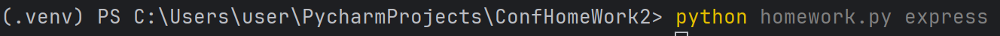

Разработать инструмент командной строки для визуализации графа
зависимостей, включая транзитивные зависимости. Сторонние средства для
получения зависимостей использовать нельзя.
Зависимости определяются по имени пакета языка JavaScript (npm). Для
описания графа зависимостей используется представление Graphviz.
Визуализатор должен выводить результат на экран в виде кода.
Конфигурационный файл имеет формат json и содержит:
• Путь к программе для визуализации графов.
• Имя анализируемого пакета.
• Путь к файлу-результату в виде кода.
• Максимальная глубина анализа зависимостей.
• URL-адрес репозитория.
Все функции визуализатора зависимостей должны быть покрыты тестами.

Тестирование работы:

В резульатте работы создан файл graph.dot
